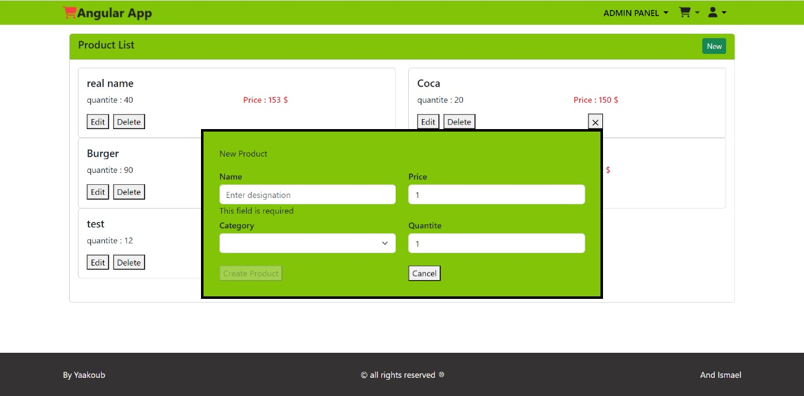

# Angular Project - Simple E-commerce Application

This project is a simple Angular application for managing products and categories in an e-commerce context.

## Table of Contents

- [Installation](#installation)
- [Features](#features) 
- [Backend Link](#backend_link) 
- [Dependencies](#dependencies) 


## Installation

1. Clone the repository:

   ```bash
   git clone https://github.com/ChakerYaakoub/Angular-E-commerce-Project.git
   ```


2. Navigate to the project directory: 
   ```bash
   cd Angular-E-commerce-Project
   ```

  
3. Install dependencies:
   ``` bash
   npm install
   ```
4. Start the development server:
   ``` bash
   ng serve
   ```

### Open your browser and navigate to http://localhost:4200/.
## Features
- Add New Product: Add a new product to the system.
- Search Product: Search for products by name or category.
- Edit Product: Edit existing product details.
- Delete Product: Remove a product from the system.
- Add/Remove/Edit Categories: Manage product categories.

### Example:

#### Home page:


#### Admin panel:



## Backend_Link : 

If you're looking for the backend code for this project, it is hosted on GitHub. You can find it [here](https://github.com/medism14/ProjetsJs/tree/backend).


## Dependencies

-  javaScript 
-  Angular
